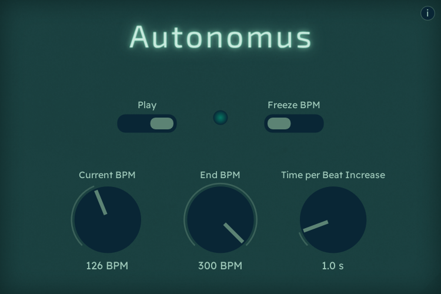

    

**Autonomus** is an automatic metronome that increases or decreases beats per minute automatically based on the selected start BPM, end BPM and how fast the tempo changes.

## Installation

** TODO **: The app is available as a standalone executable for macOS and Windows:

## How to use

The app features the following controls:

- **Play:** plays or stops the metronome. The LED light at the center of the app will flash every time the click is triggered.

- **Freeze BPM:** this setting freezes the BPM and keeps it constant, making it a normal metronome. You can unfreeze the tempo at any time and it will continue where it left off.

- **Current BPM:** shows the current tempo and also functions as the starting point for the metronome.

- **End BPM:** the tempo that the metronome will stop at. You can set it to a value below the current BPM too.

- **Time per Beat Increase:** the number of seconds it takes to add or subtract a beat from the current BPM (for example, Time per Beat Increase at 0.5 is equivalent to increasing the tempo by 2 every second).